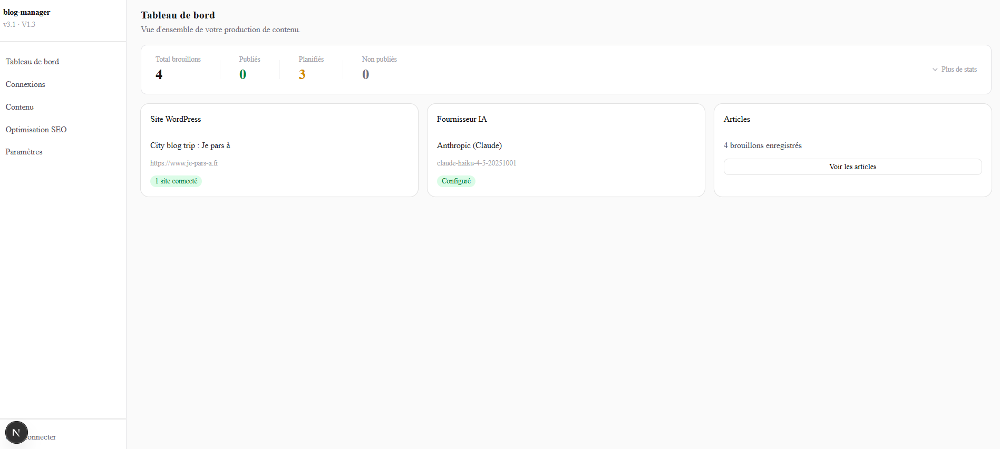
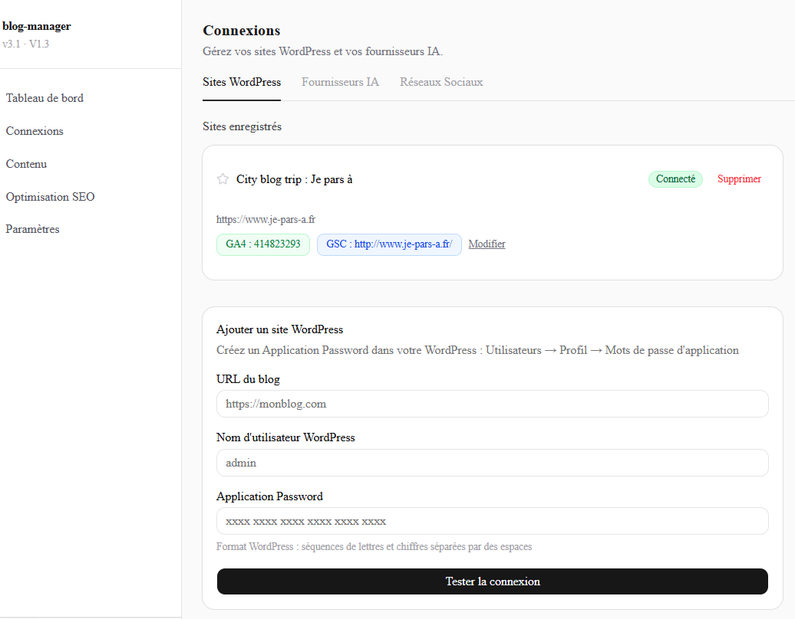
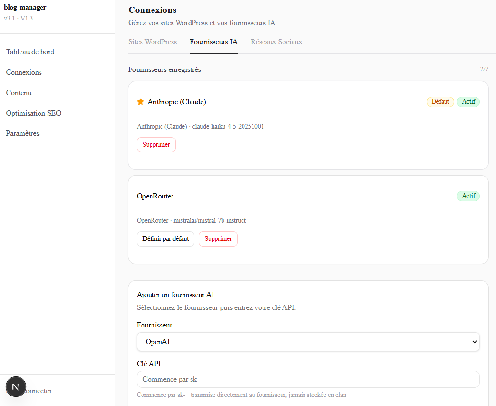
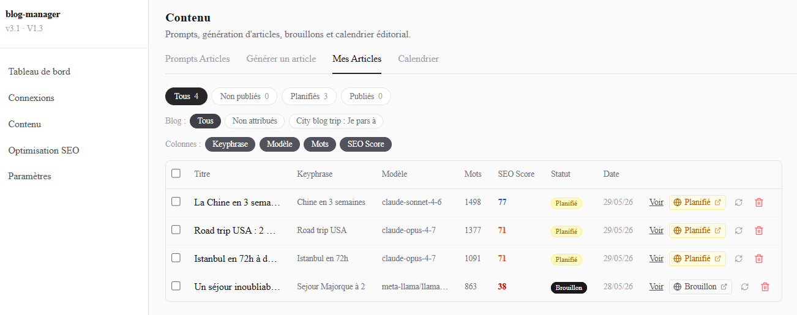
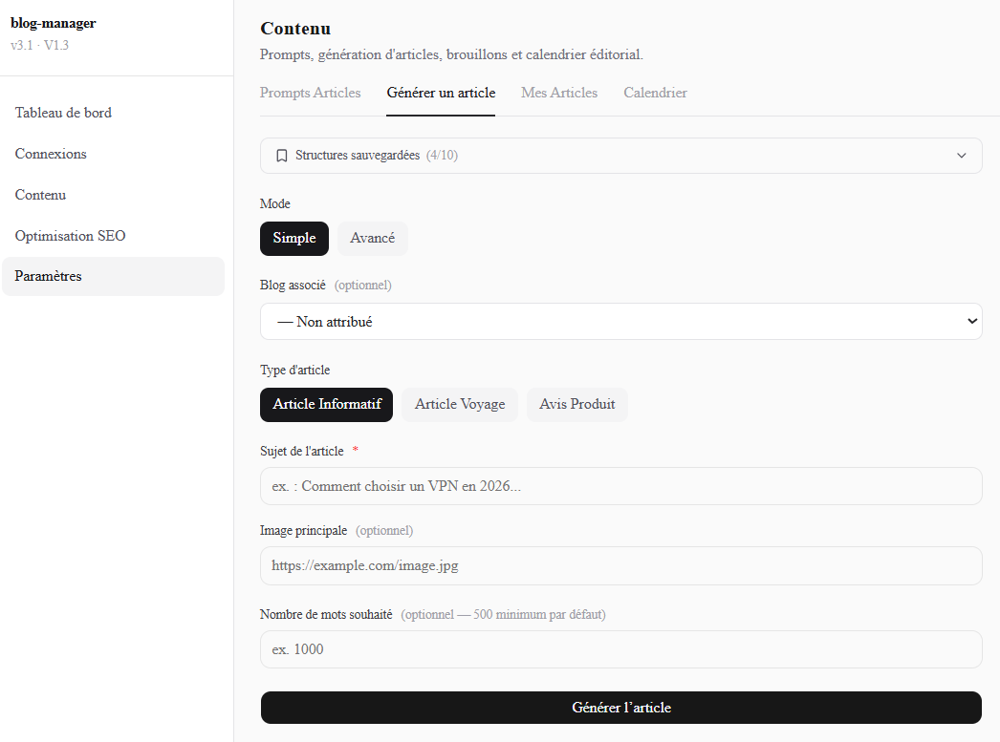
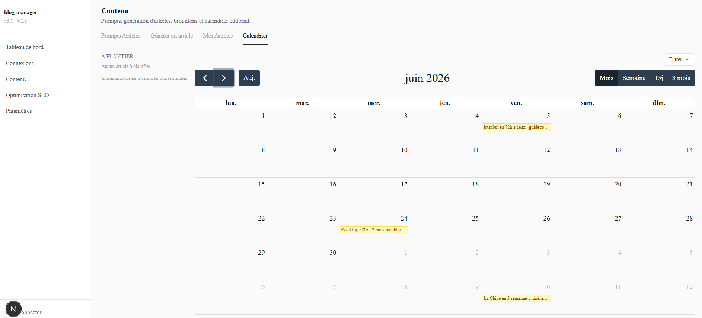
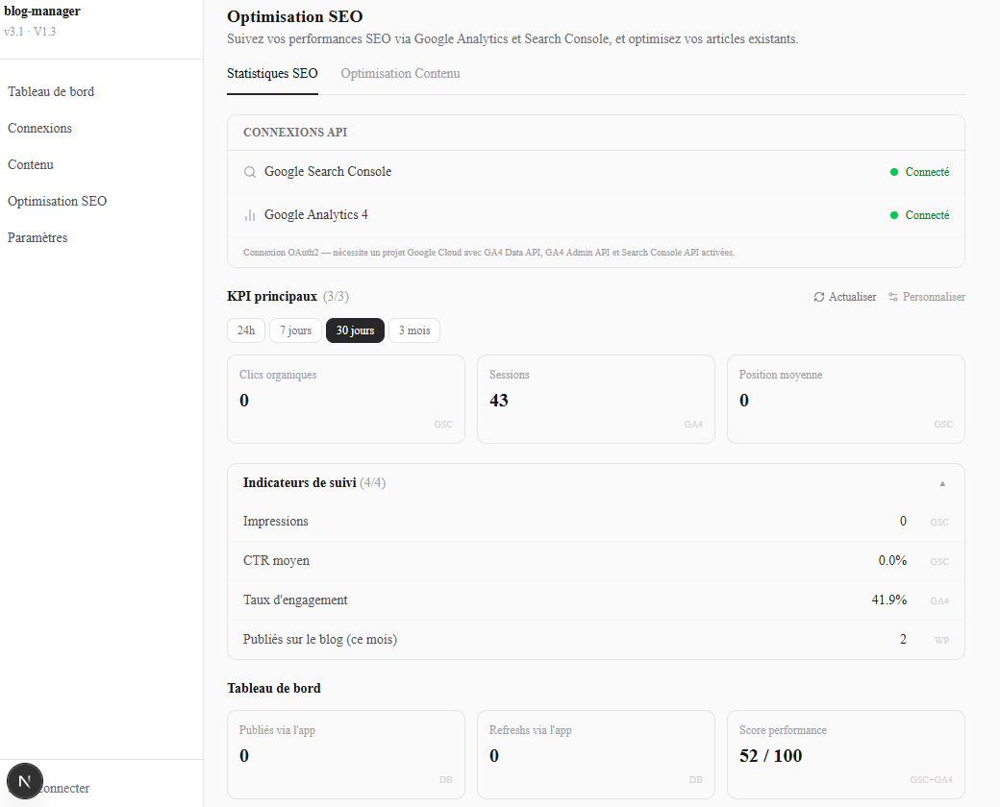
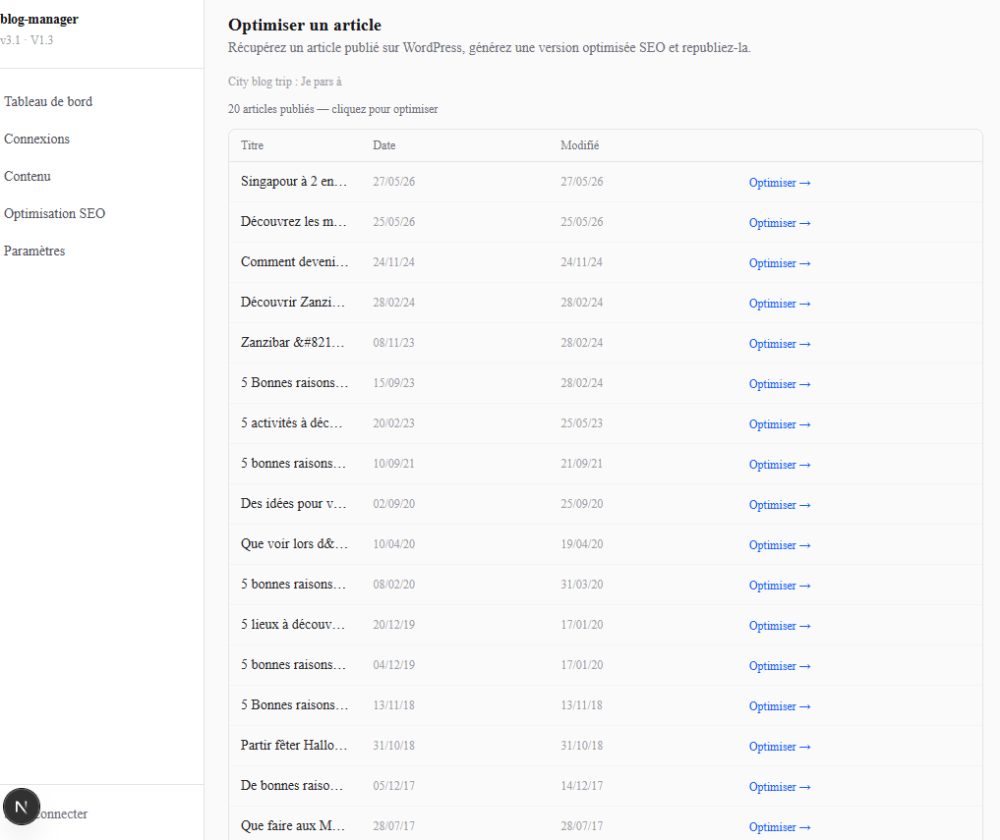
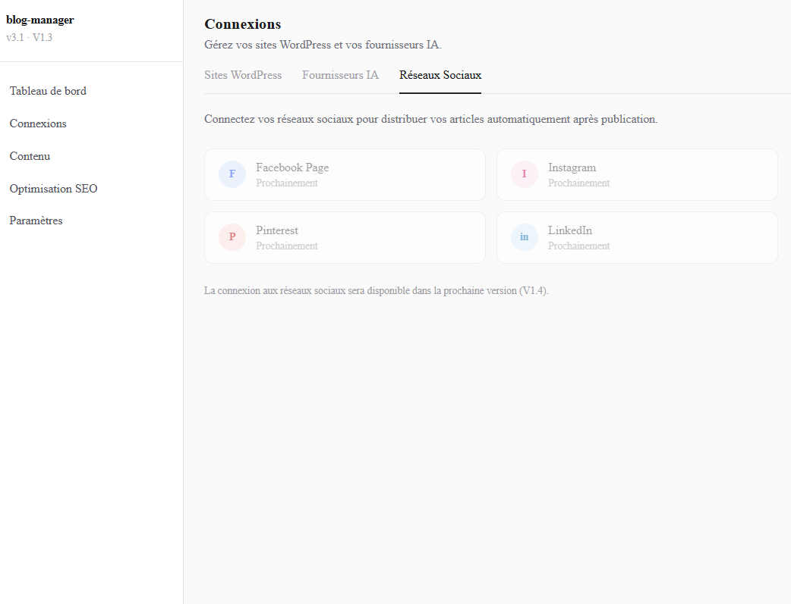

# AI Blog Manager — AI-Assisted Content Production Dashboard
AI-powered content management platform for WordPress blogs: SEO optimization, editorial planning, social distribution and automated publishing workflows.

> **Status:** 🟢 **Live in production — private beta (invite-only), now opening to first testers.**
> **Live demo:** https://blog-manager-blush.vercel.app
>
> Public showcase repository for recruiters and technical reviewers. The application source code is kept in a separate private repository — this page documents the architecture, decisions and engineering methodology behind the project.

---

## What it does

Blog Manager is a full-stack web application that turns a prompt into a published WordPress article — with AI generation, SEO scoring, editorial calendar, and real Google Analytics + Search Console KPIs in a single dashboard.

**Core workflow:**
```
Prompt → AI generation (multi-provider) → structured output validation
→ local draft with SEO scoring → WordPress draft/schedule/publish
→ editorial calendar → social distribution (LinkedIn) → SEO tracking (GA4 + GSC)
```

---

## Live & deployed

The application is deployed and running in production:

| Aspect | Setup |
|--------|-------|
| **Application** | Next.js (UI + API routes + server actions) on **Vercel** (Production + automatic preview per branch) |
| **Database** | **PostgreSQL on Railway** (managed, isolated prod/dev instances) |
| **Migrations** | Applied automatically at build (`prisma migrate deploy`) — code and schema ship in one pipeline |
| **Scheduled publishing** | **Vercel Cron** triggers a secret-protected endpoint — stateless, serverless-safe (no in-memory timers) |
| **Secrets** | Environment-scoped (Production / Preview), never in source or Git |
| **Access** | Invite-only registration + public waitlist (Cloudflare Turnstile anti-spam) |

Branch workflow: `feature/*` → Vercel preview → review → merge to `main` → production build → version tag (`v1.0.0`, `v1.1.0`, `v1.2.0`).

## Demo 

[](https://youtu.be/jW7yww5LIqs)

Watch the demo on YouTube: https://youtu.be/jW7yww5LIqs

## Screenshots

### Dashboard

Centralized overview of connected blogs, AI providers, content workflows and publishing activity.



### WordPress Connection

Connect an existing WordPress website through the REST API and retrieve categories, articles and site metadata.



### AI Provider Configuration

Configure and manage AI providers for content generation workflows.



### Article Dashboard

Manage articles, publication status and content lifecycle from a single interface.



### Article Creation

Generate and prepare content for publication using AI-assisted workflows.



### Editorial Planning

Plan and organize future publications through a dedicated content calendar.



### SEO Optimization

Review and optimize content using integrated SEO recommendations and scoring.



### SEO Article Optimization

Improve existing content before publication.



### Social Media Connections

Connect social media platforms for future automated content distribution.




---

## Tech Stack

| Layer | Choice | Why |
|-------|--------|-----|
| Framework | Next.js 16 App Router | Server Actions, RSC, Edge-compatible auth |
| Language | TypeScript (strict) | Full type safety across client + server |
| Database | Prisma v5 + PostgreSQL (Railway) | Relational integrity, serverless-ready, clean migrations |
| Auth | Auth.js v5 (JWT strategy) | Edge-compatible middleware, credentials + OAuth |
| UI | Tailwind CSS + shadcn/ui v4 | Accessible component primitives |
| Calendar | FullCalendar | Event grouping, drag-and-drop scheduling |
| AI providers | OpenAI, Anthropic, Mistral, OpenRouter | Unified abstraction layer |
| Analytics | Google Analytics 4 Data API + Search Console API | Real SEO KPIs, OAuth2 |

---

## Architecture highlights

### 1. Multi-provider AI abstraction

All AI providers (OpenAI, Anthropic, Mistral, OpenRouter) are routed through a unified interface with timeout control and structured JSON output enforcement:

```typescript
// lib/ai/provider-call.ts
export async function callProviderWithTimeout(
  providerType: ProviderType,
  apiKey: string,
  model: string,
  prompt: string,
  signal?: AbortSignal
): Promise<string>
```

Generation calls enforce a structured JSON contract — if the model returns prose, a multi-step extraction + `jsonrepair` fallback recovers the output before it ever reaches the database.

### 2. Credential encryption (AES-256-GCM)

No user credential — API keys, WordPress application passwords, Google OAuth refresh tokens — is stored in plaintext. Every secret goes through:

```typescript
// lib/security/encrypt.ts
encrypt(value: string): { encryptedValue: string; iv: string }
decrypt(encryptedValue: string, iv: string): string
```

The encryption key lives in the server environment only, never in the database or Git. All writes go through a server action that validates session ownership before touching any credential.

### 3. OAuth2 for external APIs

The same pattern handles Google (GA4 + Search Console) and social platforms:
- Authorization URL built server-side, CSRF state validated on callback
- Short-lived tokens exchanged for long-lived tokens
- Refresh tokens encrypted and stored per user
- Access token auto-refresh before every API call

### 4. SEO scoring engine

Articles are scored client-side against a configurable set of checks (keyphrase density, meta length, heading structure, introduction strength, link counts). The score is computed from the draft content without any API call — instant feedback on every edit.

### 5. KPI catalog system

14 selectable KPIs + 3 fixed dashboard metrics, stored in localStorage per user per site. The catalog pattern separates metric definition from rendering:

```typescript
type KpiEntry = {
  key: KpiKey
  label: string
  getValue: (kpis: SiteKpiData) => number | null
  format: (v: number) => string
  unit?: string
}
```

This makes adding a new KPI a one-line addition to the catalog, with no changes to the rendering layer.

---

## Security posture

- All server actions validate session ownership before any DB read/write
- SSRF guard on WordPress URL discovery (blocks private IP ranges)
- No secret ever passed to an AI model
- Audit log on every WordPress write action
- AES-256-GCM encryption for all user credentials
- Invite-only registration in production; public waitlist protected by Cloudflare Turnstile + honeypot

---

## Feature set (in production)

- **Multi-provider article generation** — structured output, 500-word floor enforcement, JSON repair fallback
- **Article rework & refresh** — AI revision of drafts and re-optimization of published articles (diff review before republish)
- **WordPress integration** — draft creation, scheduling, publishing with Yoast SEO field forwarding
- **Editorial calendar** — color-coded by status, drag-and-drop rescheduling
- **SEO scoring** — real-time keyphrase analysis, meta checks, structure scoring
- **GA4 + Search Console** — OAuth2, real KPI data (clicks, impressions, CTR, position, sessions, engagement)
- **Social distribution** — LinkedIn post generation + scheduled publishing via Vercel Cron
- **Admin & access** — invite-only registration, admin panel (invite codes, feedback inbox, global stats), public waitlist

---

## Roadmap

### Responsive / mobile
Mobile-first navigation and touch-friendly layouts (top-bar menu, adapted tables and calendar), desktop preserved.

### Additional social channels
Pinterest (boards API) and Meta — Facebook Page + Instagram Business (Graph API). LinkedIn already shipped.

### AI Engineering layer

Three features that move the project from "AI wrapper" to "AI-native application":

**Embeddings + semantic search**
Vectorize every saved draft using `text-embedding-3-small`. Surface duplicate detection before generation ("you already have an article on this topic") and enable semantic search across drafts.

**RAG-augmented generation**
At generation time, retrieve the 3–5 semantically closest existing articles and inject them into the prompt context. Ensures tonal consistency, avoids repetition, and auto-suggests internal links. Classic private-document RAG — directly applicable to enterprise content workflows.

**LLM-as-judge evaluation**
After generation, a second lightweight LLM call scores the article on 5 criteria (coherence, keyphrase density, readability, introduction strength, conclusion clarity) and returns actionable suggestions. Implements the "evals" pattern increasingly required in production AI systems.

---

## Agentic development methodology

Beyond the application itself, this project demonstrates a structured approach to building with AI coding agents — a workflow designed for reproducibility, safety, and context continuity across sessions.

### Multi-agent architecture

The project is built using two specialized AI agents with distinct roles:

| Agent | Role |
|-------|------|
| **Claude Code** | Primary implementation — feature development, architecture decisions, refactoring |
| **OpenAI Codex CLI** | Independent code review — security audit, lint/typecheck validation, cross-agent verification |

Running a second agent for review catches blind spots the implementing agent may have (shared assumptions, missing ownership checks, inconsistent patterns). The code review gate is documented and must pass before any new phase begins.

### Instruction layer — `AGENTS.md`

The repository ships with a detailed `AGENTS.md` file that acts as a persistent system prompt for any coding agent working in the repo. It defines:

- **Security rules** — what the agent must never do (expose secrets, publish without confirmation, bypass auth)
- **Coding principles** — KISS, YAGNI, DRY, hexagonal-lite architecture
- **Workflow protocol** — 8-step process from understanding the request to updating documentation
- **Output format** — terse technical delivery, no filler
- **End-of-phase checklist** — which files to update before any commit closing a milestone
- **Pre-compaction rule** — before the context window fills, always persist state to `current_state.md`

This means any new agent session — or a different agent entirely — can resume work with full context by reading a single file.

### Token optimization — Cave mode

Long-running AI coding sessions waste tokens on filler, recaps, and irrelevant context. A dedicated `tokens_optimisations.md` defines "Cave mode" rules, always active:

- Load only directly relevant files — no full repo scans by default
- No openers, no process narration, no trailing summaries
- Terse technical fragments in responses
- Explicit context loading policy: which file to load and when (bugs only when debugging, logs only when logging, etc.)

This reduces session token cost without losing quality — and models the kind of cost-aware AI usage expected in production systems.

### Living documentation ecosystem

The project maintains a set of always-current files that any agent (or human) can use to resume work instantly:

| File | Purpose |
|------|---------|
| `current_state.md` | Single source of truth — current phase, blockers, key decisions, all modified files |
| `PLAN.md` | Phased roadmap with sub-tasks, exit criteria, and architecture decisions per phase |
| `documentation/logs.md` | Dated change log — what changed, why, risks |
| `documentation/bugs.md` | Bug registry with root cause, fix, and prevention note |
| `tests/tests.md` | Test status per area — manual and automated, with dates |
| `documentation/code_review.md` | Formal review findings with priority ranking |
| `documentation/UX_review.md` | All UX decisions + professional UX principles applied |
| `documentation/tech_choice.md` | Architecture decisions with rationale and trade-offs |

No knowledge lives only in chat history. Every significant decision is written to a file before the session ends.

### Iterative phase-based delivery

Each feature phase follows the same discipline:

```
1. Define expected behavior before writing any code
2. Implement the smallest safe change
3. Validate: lint + tsc --noEmit + manual test
4. Update current_state.md, logs.md, bugs.md, tests.md
5. Commit and push — one phase = one clean commit
6. Code review gate before starting the next phase
```

Phases are broken into sub-parts (e.g. V1.3-A → V1.3-B → V1.3-C → V1.3-D) so each push is independently testable and reversible. Database migrations follow a mandatory backup protocol — a prior incident of catastrophic data loss (all user data wiped by an accidental `prisma migrate reset`) led to a hard rule: `npm run db:backup` before every migration, enforced in `AGENTS.md`.

### What this approach demonstrates

- Practical experience running multi-agent workflows on a real codebase
- Ability to design instruction sets that make AI agents reliable and consistent
- Context management discipline across long, multi-session projects
- Safety-first mindset: backup rules, review gates, confirmation before destructive actions
- Documentation as a first-class engineering artifact, not an afterthought

---

## What this demonstrates

| Skill | Where |
|-------|-------|
| Full-stack TypeScript with Next.js App Router | Entire codebase |
| OAuth2 implementation (authorization code flow) | Google + social platforms |
| Credential encryption and secret management | `lib/security/` |
| Multi-provider AI integration with structured output | `lib/ai/` |
| External API integration (WP REST, GA4, Search Console) | `lib/wordpress/`, `lib/analytics/` |
| Prisma schema design + safe migration discipline | `prisma/` |
| UX architecture (progressive disclosure, KPI catalog, tab routing) | `components/` |
| Multi-agent development workflow with review gates | `AGENTS.md`, `documentation/` |
| Token-optimized AI session management | `tokens_optimisations.md` |
| RAG + embeddings + LLM-as-judge (upcoming V1.8) | Planned |

---

*Built with Next.js 16 · TypeScript · Prisma · PostgreSQL · Auth.js v5 · OpenAI / Anthropic / Mistral · Google APIs · LinkedIn API · deployed on Vercel + Railway*
*Developed using Claude Code + OpenAI Codex CLI in a structured multi-agent workflow.*

